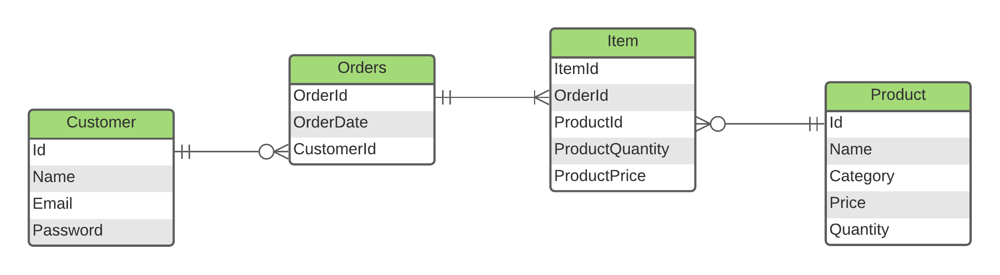

# ShopBridge REST API
Rest API using .Net 6

### ER Diagram


### How to Run
Clone the repo
```
git clone https://github.com/Shubham-Vishwakarma/ShopBridge
```

Setup the database (File present at: [database.sql](https://github.com/Shubham-Vishwakarma/ShopBridge/blob/main/Schema/dbexport.sql))
```
mysql> create database shopbridge;
mysql> use shopbridge;
mysql> source database.sql;
```

Run the REST API
```
dotnet build
dotnet run
```

### Reference: 
* https://www.red-gate.com/simple-talk/development/dotnet-development/build-a-rest-api-in-net-core/
* https://www.c-sharpcorner.com/article/tutorial-use-entity-framework-core-5-0-in-net-core-3-1-with-mysql-database-by2/
* https://jasonwatmore.com/post/2021/10/26/net-5-connect-to-mysql-database-with-entity-framework-core

### Scaffold an existing Database
```
dotnet ef dbcontext scaffold "server=localhost;port=3306;database=shopbridge;uid=xxxx;password=xxxx" "Pomelo.EntityFrameworkCore.Mysql" --output-dir Models --force
```